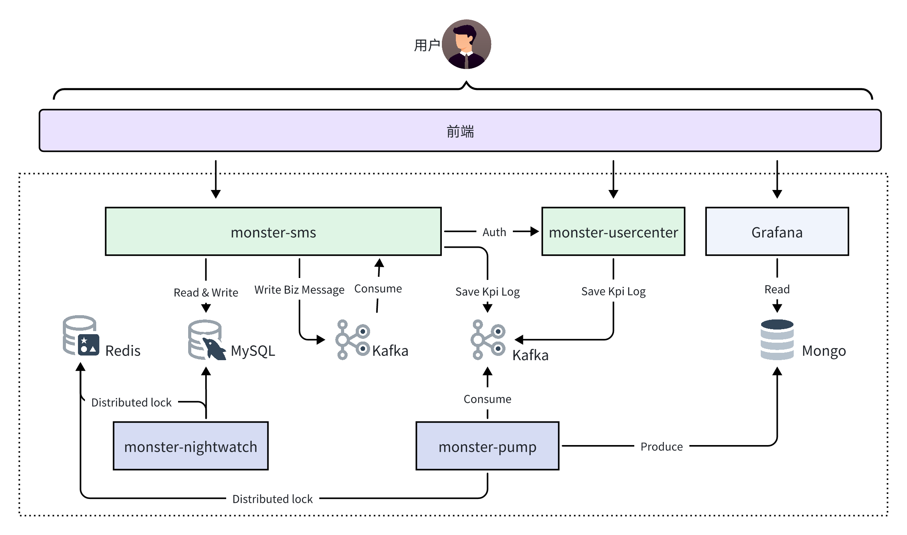

# streaming短信服务系统
streaming是一个短信服务系统。streaming项目的设计，足以承载企业业务开发时用到的大部分技能点。

# streaming项目功能概述
streaming是一个短信服务系统。在该系统你可以注册用户，创建短信模板，并使用短信模板进行短信发送。创建短信模板时需要指定短信限流策略，确保用户的短信请求速率和次数在合理的范围内。

本系统实现了通知短信、验证码短信、状态报告接收、上行短信接收、短信发送历史等功能，可为多个前端系统提供统一的API，用于实时交付场景，如验证码、电子票据和欢迎消息等。

另外，本系统可接入多家短信供应商，实现供应商的选择和主备切换，保障系统高可用。

# streaming项目项目架构
streaming架构图如下：

streaming短信服务系统的业务流程如下：

1.用户登录：用户通过前端登录streaming平台，前端会调用streaming-usercenter组件提供的RESTful API接口登录系统，登录成功（用户名：密码验证成功），后端返回Token，前端通过该Token跟后端交互。

2.创建短信模板：用户使用步骤1中生成的Token，访问streaming-sms组件，streaming-sms组件根据请求信息，访问streaming-usercenter进行认证。认证通过后，streaming-sms会生成模板码，创建短信模板。

3.发送短信：用户将模板码提供给其他前端系统，相关系统可以使用该模板码发送短信

4.规则校验：streaming-sms组件接收到短信发送请求，根据模板码获取限流策略，进行前置校验。

5.消息组装：校验通过后，streaming-sms组件生成消息幂等ID并组装短信请求消息，发送到Kafka队列，实现流量削峰。

6.异步处理：streaming-sms组件的消息消费模块开始处理短信请求消息，通过请求幂等模块完成消息幂等校验。校验通过后，向对应的供应商发起实际的短信发送请求。

7.短信历史：根据短信发送结果，记录短信发送的历史记录

# streaming组件功能介绍
上面，我们介绍了streaming的架构和整体流程，其中涉及几个组件，列表如下：

| **组件名** | **功能介绍** |
| :---: | --- |
| 前端(未实现) | streaming系统管理端 |
| streaming-usercenter | 用户中心。用来支持其他组件的认证和授权 |
| streaming-sms | 短信服务。用来提供短信操作的功能。 |
| streaming-pump | ETL数据抽取服务。用来消费Kafka中的埋点日志，处理后保存到Mongo中，后续可接入日志系统和告警平台 |
| streaming-nightwatch | 分布式异步任务处理服务。作为streaming系统异步任务处理引擎，执行各类异步任务。本系统用来清理短信历史记录。 |

# streaming功能列表
| **功能项** | **功能列表**                                                                                                                                                                                                                 |
| :---: |--------------------------------------------------------------------------------------------------------------------------------------------------------------------------------------------------------------------------|
| 代码架构 | 简洁架构                                                                                                                                                                                                                     |
| 设计模式 | 单例模式、简单工厂模式、抽象工厂模式、工厂方法模式、策略模式、选项模式、责任链模式                                                                                                                                                                                |
| 常用功能 | 日志包设计、错误包设计、错误码设计、应用框架构建设计                                                                                                                                                                                               |
| 中间件 | MySQL、Redis、Kafka、Mongo                                                                                                                                                                                                  |
| 参数校验 | 基于Tag的校验、自定义校验                                                                                                                                                                                                           |
| 应用功能 | Web服务： - 通信协议：HTTP/HTTPS/GRPC - 路由：路由分组、路由匹配 - 安全：认证、授权 - 中间件：跨域、日志、校验、请求ID等 - 参数处理：参数解析、参数校验、逻辑处理、参数返回 分布式任务处理服务 消息队列消费 ETL数据抽取 命令行工具                                              |
| 优秀的go包使用 | 中间件：go-redis、gorm、kafka-go、mongo-driver web框架：grpc、gin 命令行工具：cobra、pflag、viper 认证：golang-jwt 校验：go-playground/validator 日志：zap 定时任务：robfig/cron HTTP客户端：retry 分布式锁：redsync 授权：casbin |

# 联系我
- 邮箱：starry99c@163.com

